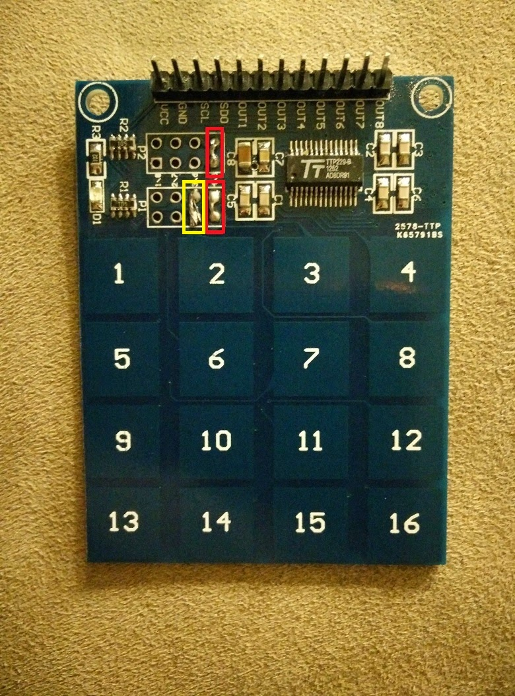
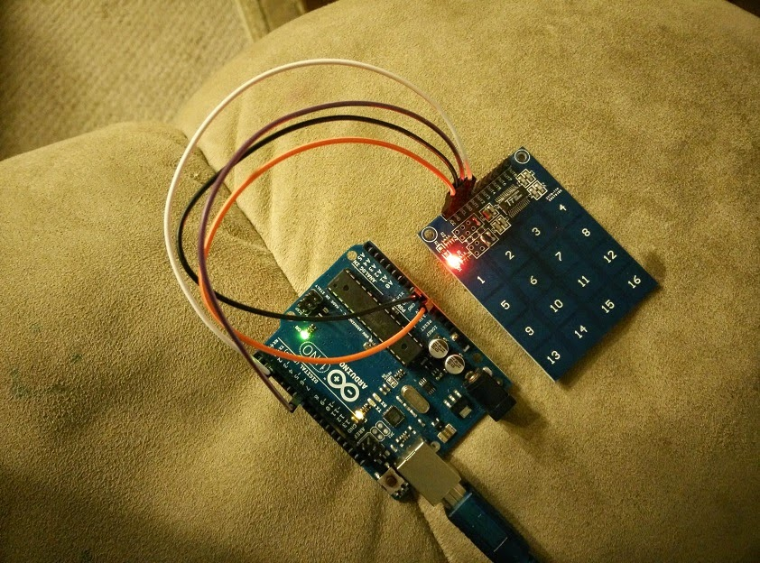
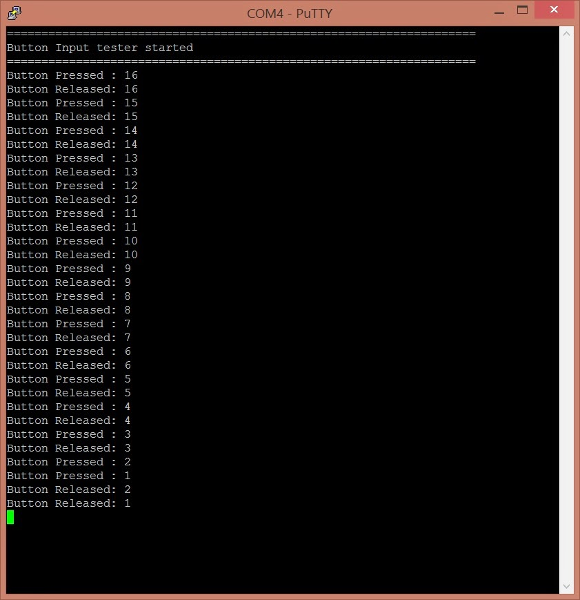

## All Credit goes to: https://itimewaste.blogspot.com/2014/12/arduino-code-for-ttp229-touch-16-button.html?showComment=1645100905934#c528859924059238124
** I just made sure it is presered and commited the code file to git **

Arduino Code for TTP229 16 Key Touch button
I could not find the arduino library code for TTP229 keys and hoping this will help others who have bought this item from ebay to be able to use the keyboard.

The pin layout is clear enough that only 8 buttons were mapped to direct pin mapping. In order to use full 16 buttons, direct pin mapping is definitely not the way to go. So the serial clock and data line has to be used.

Finding the proper datasheet was a major problem. First I got reference to two conflicting documents, one located here and another here.

The first datasheet had a pin layout for TTP229 as 28 pins which matched with the hardware chip. But second link had a pin layout of TTP229 containing 48pins which did not match what was in hardware. So obvious choice to follow in the datasheet seemed to be the first link which is from datasheet4u. The document mentions that keyboard supports I2C and was happy to hear it. I put that under the buspirate and nothing was detected. After checking all connection, it did not seem to be supporting any i2c protocol and the initial excitement was subdued. Then I decided to see the waveform for serial clock. It was outputting the data as expected as per specification two here. So even though the pin diagram of TTP229 (48pin) does not match the actual hardware pin (28pins), decided to follow it to see what happens.

From the captured waveform subdued the moment I realized that button is outputting 0 for the button number that is pressed as well as for button number+8. So the waveform contained two 0s for even a single key being pressed. After a bit of reading the default configuration as per the spec is, TTP229 works in 8 key mode. In order to make it work in 16 key mode, one has to connect TP2 to ground through a high value resistor. Then referring to the schematic diagram, it is easy to find there is a handy high value resistor (1M) connected to header next to each of the buttons. By manually verifying the wire trace matching with the schematic diagram, decided to connect TP2 to Gnd.

Initially I was skeptical manufacturer will send a 16key keyboard configured to work as 8key keyboard. But after convincing myself that I have done enough reading, and a good enough dose of get it to work or burn it, I added a trace connecting pins (highlighted in Yellow) as shown in the picture.

 

Then tried the code and it seemed to work exactly as wanted. Emboldened by the success I added two more traces to support multi-key (highlighted in Red). That also worked perfectly. Interestingly, the pressed keys wont appear even if new key has been pressed. Only after the second key is released the first key is shown as pressed.

After going through the spec, I realized it can even be used for interrupts. The spec says the keyboard can generate interrupt every 32ms min. It generates the long low to indicate a button press or release event. It is upto the microcontroller to read the data. It does not state what happens when data read takes a long time from interrupt and the key change happens, can it cause interrupt while reading or right after reading. If the interrupt happens after read but before the interrupt handler is enabled, a key press may be lost.  So, ideally the keyboard interrupt should be serviced well within 32ms, if you don't want to miss any key press. Depending on the exact behavior of the chip, the current code has a potential to have missed data, if the interrupt service routing is not called within 32ms of the key being pressed.

Also, the code takes a bit of time to read from the keyboard. So decided to keep the interrupt service separate from interrupt handler. So the caller has to keep calling HasEvent and if it has Event, then it may call GetButtonEvent to get the event. The event will be triggered for Press and Release and the caller has to find out how long the button was pressed.

On the other hand, calling GetButtonStatus will return the buttons pressed currently.

**In short, here is the instruction to get the keyboard working with Arduino**
1. Add a trace between 3&4 in header P1 (highlighted with yellow). This is the must if you want to use all 16 buttons. Refer to the picture above.
2. Add a trace between 1&2 in header P1 and 7&8 in  header P2 (highlighted in Red). This is optional and needed only if you want to enable multi-key press at the same time. Refer to the picture above.
3. Connect the VCC & GND from the keyboard to corresponding pin in arduino.
4. Connect SCL from the keyboard to pin 7 in arduino. (If you connect to anything else, need to update the code with the right pin number. Find the line containing statement TTP16Button.Configure and replace 7 with what ever your pin number is used by you.)
5. Connect SDO from the keyboard to pin 2 in arduino. (Connecting to 2 or 3 will support interrupt based event for the keyboard and others has to be constantly polled. Find and replace line containing TTP16Button.Configure with SDO number.)

Here is how my connection looks like

 

You are good to go and should be able to see the output in the serial port. This is what I saw in my keyboard

This is the output for pressing keys from 16 to 1. But when key 2 is pressed I pressed key 1, that is why you see Button Pressed : 2 followed by pressed 1 and then both these keys are released.

The code can be found here. Feel free to copy/modify and repost the code.
